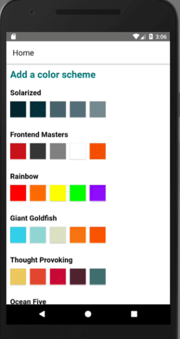

<!--
*** Thanks for checking out this README Template. If you have a suggestion that would
*** make this better, please fork the repo and create a pull request or simply open
*** an issue with the tag "enhancement".
*** Thanks again! Now go create something AMAZING! :D
-->

<!-- PROJECT SHIELDS -->
<!--
*** I'm using markdown "reference style" links for readability.
*** Reference links are enclosed in brackets [ ] instead of parentheses ( ).
*** See the bottom of this document for the declaration of the reference variables
*** for contributors-url, forks-url, etc. This is an optional, concise syntax you may use.
*** https://www.markdownguide.org/basic-syntax/#reference-style-links
-->

[![Contributors][contributors-shield]][contributors-url]
[![Forks][forks-shield]][forks-url]
[![Stargazers][stars-shield]][stars-url]
[![Issues][issues-shield]][issues-url]


# React Native App

> A practice using REACT NATIVE to create a mobile app where users can create their own palettes color schemes.



Additional description about the project and its features.

## Built With

- CSS
- JAVASCRIPT
- NPM
- REACT NATIVE
- NODE
- EXPO
- ESLINT
- VSCODE

## Getting Started

### Usage

To have this app on your pc, you need to:

- [download](https://github.com/javitocor/PaletteScheme/archive/main.zip) or clone this repo:

  - Clone with SSH:

  ```
    git@github.com:javitocor/PaletteScheme.git
  ```

  - Clone with HTTPS

  ```
    https://github.com/javitocor/PaletteScheme.git
  ```

- In the project directory, you can run:

  - `$ npm install` - installs all the dependencies required by the project

  - `$ npm start` or `$ expo start` - runs the app in the development mode:

    - Open the QR code with your Expo app from your android phone.
    - The app will reload if you make edits.
    - You will also see any lint errors in the console.

## Author

👤 Javier Oriol Correas Sanchez Cuesta

- Github: [@javitocor](https://github.com/javitocor)
- Twitter: [@JavierCorreas4](https://twitter.com/JavierCorreas4)
- Linkedin: [Javier Oriol Correas Sanchez Cuesta](https://www.linkedin.com/in/javier-correas-sanchez-cuesta-15289482/)

## 🤝 Contributing

Contributions, issues and feature requests are welcome!

Feel free to check the [issues page](https://github.com/javitocor/PaletteScheme/issues).

## Show your support

Give a ⭐️ if you like this project!

## Acknowledgments 🚀

- [React Native Documentation](https://reactnative.dev/docs/getting-started)
- [Frontend Masters](https://frontendmasters.com/courses/react-native-v2)

## 📝 License

This project is [MIT](lic.url) licensed.

<!-- MARKDOWN LINKS & IMAGES -->
<!-- https://www.markdownguide.org/basic-syntax/#reference-style-links -->

[contributors-shield]: https://img.shields.io/github/contributors/javitocor/PaletteScheme.svg?style=flat-square
[contributors-url]: https://github.com/javitocor/PaletteScheme/graphs/contributors
[forks-shield]: https://img.shields.io/github/forks/javitocor/PaletteScheme.svg?style=flat-square
[forks-url]: https://github.com/javitocor/PaletteScheme/network/members
[stars-shield]: https://img.shields.io/github/stars/javitocor/PaletteScheme.svg?style=flat-square
[stars-url]: https://github.com/javitocor/PaletteScheme/stargazers
[issues-shield]: https://img.shields.io/github/issues/javitocor/PaletteScheme.svg?style=flat-square
[issues-url]: https://github.com/javitocor/PaletteScheme/issues
